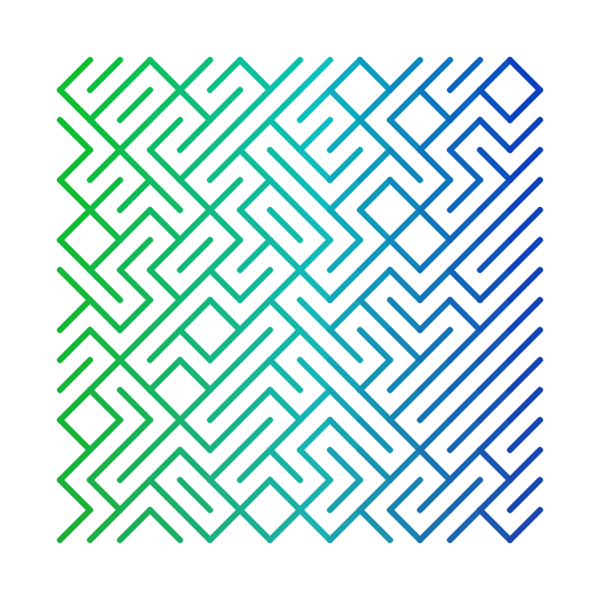

# 🍽️ play-ts (pronounced 'plates')

## Principles

Opionated, agile (code is easy to change) framework for algorithmic art.

- Sketches always have width 1, height depends on aspect ratio.
- Angles in radians.
- Points are [number, number].
- Colours in hsl(a).
- Leverage TypeScript: you shouldn't need to learn much, autocomplete and type checking should have your back.
- Not for beginners.
- Control flow at level of drawing (tiling, partitions etc).
- Few dependencies/mostly from scratch.
- Performance is not the goal.
- Common argorthmic art things (e.g. randomness) should be easy.
- Should feel fun/powerful.
- Declarative when possible (especially anything configuration-y), proceedural when pragmatic.

## Early

Not even packaged nicely as library yet, but as simple demo using Parcel/React to give UI. [Live Demo](https://focused-agnesi-2a3bda.netlify.com)

Start 🍽️ by

```
yarn
```

to get dependencies, then:

```
yarn start
```

It does things like the below



```typescript
pts.forTiling({ n: 20, margin: 0.1, type: "square" }, ([x, y], [dX, dY]) => {
  pts.lineStyle = { cap: "round" };
  pts.proportionately([
    [
      1,
      () => {
        pts.setStrokeColour(120 + x * 120, 90 - 20 * y, 40);
        pts.drawLine([x, y], [x + dX, y + dY]);
      }
    ],
    [
      2,
      () => {
        pts.setStrokeColour(120 + x * 120, 90 - 20 * y, 40);
        pts.drawLine([x + dX, y], [x, y + dY]);
      }
    ]
  ]);
});
```
